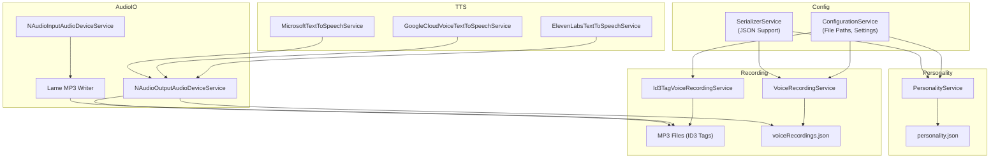
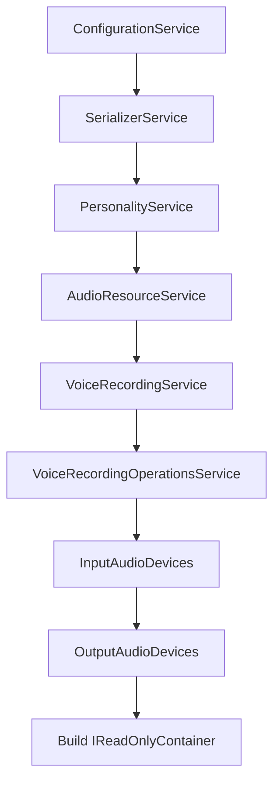

# 🐦 Kenku Voice System

Kenku is a modular, extensible voice system that supports text-to-speech (TTS), voice recording, personality management, and audio playback using multiple engines and formats.

---

## 📦 System Overview

Kenku supports the following high-level components:

| Component                   | Description                                                             |
|-----------------------------|-------------------------------------------------------------------------|
| `ITextToSpeechService`      | Interface for speaking text using various TTS providers                 |
| `IVoiceRecordingService`    | Interface for managing saved recordings (load/save/play/delete)         |
| `IPersonalityService`       | Manages speaker metadata ("personalities")                              |
| `IInputAudioDeviceService`  | Records audio from system devices                                       |
| `IOutputAudioDeviceService` | Plays audio to configured devices                                       |
| `IAudioResourceService`     | Central resource stream manager for audio files                         |
| `IConfigurationService`     | Resolves file paths, app config                                         |
| `ISerializerService`        | Handles JSON (de)serialization                                          |

---

## 🧠 Personality System

**Personality** is a unit of speaker identity. It is defined by:

- `Id: Guid`
- `Name: string`
- `Description: string`

They are stored in a JSON file managed by `PersonalityService`.  
Defaults are automatically created if missing.

---

## 🎙 Voice Recording System

Two implementations of `IVoiceRecordingService`:

### 1. `Id3TagVoiceRecordingService`

- Stores MP3 recordings
- Uses ID3 tags to embed:
  - `Text` → Title tag
  - `PersonalityId` → Conductor tag

### 2. `VoiceRecordingService`

- Stores metadata in a JSON file
- Streams (MP3/WAV) are stored separately
- Uses `SerializerService` for metadata and `AudioResourceService` for audio data

Each recording implements `IReadOnlyVoiceRecording` with:

- `Id`
- `Text`
- `StreamType`
- `PersonalityId`

---

## 🔊 Audio Input / Output

### Input (Recording):

`NAudioInputAudioDeviceService`

- Uses NAudio to capture from:
  - `WaveInEvent` for mic
  - `WasapiLoopbackCapture` for system output
- Encodes to MP3 via `LameMP3FileWriter`

### Output (Playback):

`NAudioOutputAudioDeviceService`

- Supports both MP3 and WAV playback
- Streams audio to a specific output device index

---

## 🗣️ TTS Services

All TTS implementations conform to `ITextToSpeechService`:

| Engine           | Class                                      | Output Format | Notes                             |
|------------------|---------------------------------------------|----------------|-----------------------------------|
| **ElevenLabs**   | `ElevenLabsTextToSpeechService`             | MP3            | Requires API Key                  |
| **Google Cloud** | `GoogleCloudVoiceTextToSpeechService`       | WAV            | Uses Google credentials JSON file |
| **Microsoft SAPI**| `MicrosoftTextToSpeechService`             | WAV            | Uses local `System.Speech` voices |

These services support audio playback directly using `PlayWaveAsync` / `PlayMp3Async`.

---

## 🧩 Dependency Injection Helpers

### Microsoft

```csharp
public static IReadOnlyContainer AddMicrosoftTextToSpeechServices(this IReadOnlyContainer container)
```

Registers all installed `System.Speech` voices as `MicrosoftTextToSpeechService`.

---

### Google

```csharp
public static async Task<IReadOnlyContainer> AddGoogleCloudVoiceTextToSpeechServices(this IReadOnlyContainer container, FileInfo googleCredentialsFile)
```

Loads Google TTS voices using credentials from JSON, and registers each one.

---

## 🔄 Workflow Summary

### Generate and Play Voice

1. User inputs text
2. A TTS engine is selected (`ITextToSpeechService`)
3. Text is synthesized and streamed
4. Stream is played using `IOutputAudioDeviceService`

### Record Voice Input

1. Input device selected (`IInputAudioDeviceService`)
2. Recording is started, saved to a stream
3. Stream is written as MP3 using `LameMP3FileWriter`
4. Metadata stored using `IVoiceRecordingService`

### Manage Personalities

- Personalities are loaded and saved via JSON
- Used to tag or identify speaker metadata in recordings

---

## ✅ Feature Checklist

| Feature                             | Supported |
|-------------------------------------|-----------|
| Text-to-Speech (ElevenLabs)         | ✅        |
| Text-to-Speech (Google Cloud)       | ✅        |
| Text-to-Speech (Microsoft SAPI)     | ✅        |
| Voice Recording from Microphone     | ✅        |
| Voice Recording from Loopback Audio | ✅        |
| MP3 and WAV Playback                | ✅        |
| Recording Metadata via ID3 or JSON  | ✅        |
| Personality Management              | ✅        |
| Pluggable Service Container         | ✅        |

---

## 🧰 Extendability Guide

| To Extend...                          | Implement or Modify                           |
|--------------------------------------|------------------------------------------------|
| New TTS Engine                       | `ITextToSpeechService`                         |
| New Audio Device Type                | `IInputAudioDeviceService` / `IOutputAudioDeviceService` |
| Alternate Metadata Storage           | `IVoiceRecordingService`                       |
| UI / CLI Frontend                    | Use services as injectable interfaces          |

---

## 📈 Architecture



---

# Kenku Service Builder

A modular, fluent builder pattern for constructing a fully configured Kenku service container.  
This builder enforces a strict order of service setup to ensure all dependencies are properly wired.

---

## Overview

The Kenku Builder provides a stepwise approach to build a rich container (`IReadOnlyContainer`) that manages all core Kenku services:

- Configuration management  
- Serialization  
- Personality and behavior  
- Audio resource management  
- Voice recording and operations  
- Input/output audio devices  
- Text-to-speech and emulation  

Each step in the builder chain configures and injects one or more services, returning the next step interface until the final container is built.

---

## Builder Chain Summary

### 1. Configuration Setup

- Start with an existing configuration service or specify an asset directory path.  
- Interface: `IKenkuBuilderConfigurationService`  
- Returns: `IKenkuBuilderSerializerService`

### 2. Serializer Service Setup

- Use a custom serializer or the default `SerializerService`.  
- Interface: `IKenkuBuilderSerializerService`  
- Returns: `IKenkuBuilderPersonalityService`

### 3. Personality Service Setup

- Add personality logic either by supplying a custom service or using the default `PersonalityService`.  
- Interface: `IKenkuBuilderPersonalityService`  
- Returns: `IKenkuBuilderAudioResourceService`

### 4. Audio Resource Service Setup

- Configure audio resource management with a custom or default `AudioResourceService`.  
- Interface: `IKenkuBuilderAudioResourceService`  
- Returns: `IKenkuBuilderVoiceRecordingService`

### 5. Voice Recording Service Setup

- Add voice recording capabilities with custom or default `VoiceRecordingService`.  
- Interface: `IKenkuBuilderVoiceRecordingService`  
- Returns: `IKenkuBuilderVoiceRecordingOperationsService`

### 6. Voice Recording Operations Service Setup

- Register voice recording operations service.  
- Interface: `IKenkuBuilderVoiceRecordingOperationsService`  
- Returns: `IKenkuBuilderInputAudioDevices`

### 7. Input Audio Devices Setup

- Add input audio devices (e.g., microphones).  
- Interface: `IKenkuBuilderInputAudioDevices`  
- Returns: `IKenkuBuilderOutputAudioDevices`

### 8. Output Audio Devices Setup

- Add output audio devices (e.g., speakers).  
- Interface: `IKenkuBuilderOutputAudioDevices`  
- Returns: `IKenkuBuilderFinalizer`

### 9. Finalize and Build Container

- Build the complete `IReadOnlyContainer` with all configured services wired.  
- Interface: `IKenkuBuilderFinalizer`  
- Returns: `IReadOnlyContainer`

---

## Conceptual Flow Diagram



---

## Example Usage

```csharp
var container = ServiceFactory
    .CreateContainer()
    .WithConfigurationService(myConfigService)          // Step 1
    .WithDefaultSerializerService()                      // Step 2
    .WithDefaultPersonalityService()                     // Step 3
    .WithDefaultAudioResourceService()                   // Step 4
    .WithDefaultVoiceRecordingService()                  // Step 5
    .WithVoiceRecordingOperationsService(myOpsService)  // Step 6
    .AddInputAudioDeviceServices(myInputDevices)        // Step 7
    .AddOutputAudioDeviceServices(myOutputDevices)      // Step 8
    .Build();                                            // Step 9
```

Benefits
 - Strict build order guarantees proper service initialization
- Fluent API improves readability and ease of use
- Extensibility via allowing custom implementations at every stage
- Centralized container simplifies managing all Kenku service dependencies
